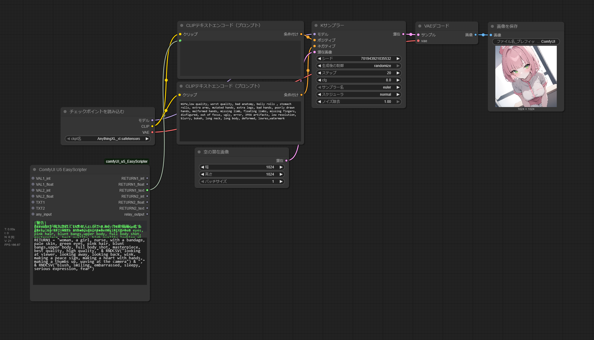
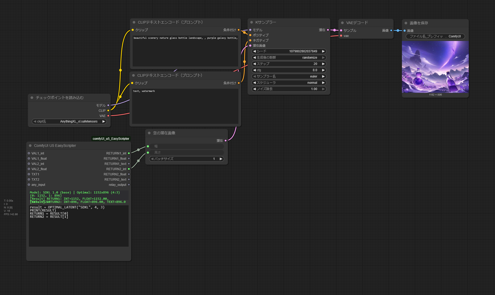
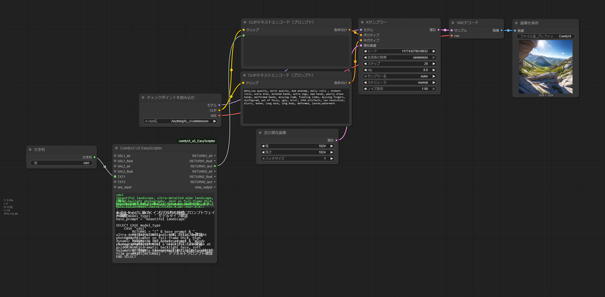
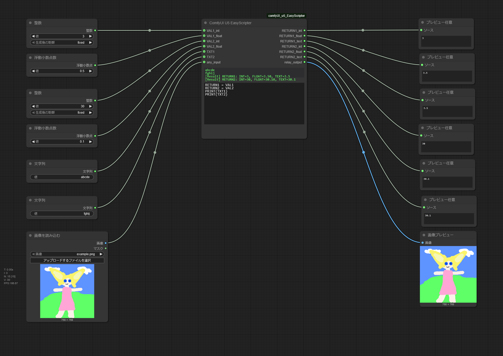

# u5 EasyScripter 节点

**语言**: [日本語](../../README.md) | [English](../en/README.md) | [中文](../zh/README.md) | [Español](../es/README.md) | [Français](../fr/README.md) | [Deutsch](../de/README.md)

---

## 这是什么?
- 在ComfyUI上运行类似VBA的**简易脚本**的自定义节点
- 可以实现条件分支、提示词生成、循环处理、外部API调用等各种内置功能
- **几乎所有函数都提供了复制粘贴示例**,即使没有编程经验也没问题
- 还内置了在其他地方公开的顺序节点和内存释放工具的增强版本

```
标准节点或单个节点的配置会变得冗长,精细控制很困难,所以制作了这个
```

---

## 推荐功能・用途
- 工作流截图图像可以直接拖入ComfyUI立即使用

### 自动生成各种变体
- 每次都想提示词很麻烦。快速生成大量幻灯片式的变体!
```vba
'基础提示词 + 每次随机替换表情和姿势来创建提示词
'→"base prompt" & "," & RNDCSV("姿势候选的CSV") & "," & RNDCSV("表情候选的CSV")

RETURN1 = "woman, a girl, nurse, with a bandage, pale skin, green eyes, pink hair, blunt bangs,upper body, full body shot, masterpiece, best quality, high quality," & RNDCSV("looking at viewer, looking away, looking back, wink, making a peace sign, making a heart with hands, making a thumbs up, waving at the camera") & "," & RNDCSV("blush, smiling, embarrassed, sleepy, serious expression, fear")
```
<br>
  ↓<br>
  只需粘贴一行<br>
  ↓<br>


### 一键自动调整模型专用的Latent(潜在)尺寸
- 这是SDXL所以分辨率如何如何,每次都处理太麻烦了!
```vba
result = OPTIMAL_LATENT("SDXL", 4, 3) ' 自动调整为1152x896
RETURN1 = RESULT[0] '1152
RETURN2 = RESULT[1] '896
```
<br>


**只需粘贴到节点下方的脚本窗口,就能立即变成具有特殊功能的专业节点**

---


## 📖 文档

详细文档请参考以下内容:


- **[📖 脚本语言参考](01_syntax_reference.md)** - 语法和控制结构完整指南
- **[🔧 内置函数参考](00_index.md)** - 100+个内置函数的完整参考
- **[🌟 请支持我们](CONTENTS.md)** - 更实用便捷的示例、丰富的工作流图像、详细的解说


---

## u5 EasyScripter的解决方案

**一个节点,无限可能** - u5 EasyScripter是运行在Comfy UI上的通用脚本引擎:

- ✅ **替换10+个专用节点**: 文本处理、数学计算、条件逻辑、随机生成
- ✅ **加速批处理**: 自动参数扫描、智能变体生成
- ✅ **增强提示词工程**: 动态权重调整、条件分支修正、智能变体
- ✅ **优化工作流**: 清晰的图表、快速加载、轻松共享
- ✅ **可扩展**: 从简单计算到复杂自动化算法都能对应
- ✅ **并行执行保护**: 多个节点同时执行时也不会挂起,安全排队处理
- ✅ **多语言支持**: 支持日语和英语的错误消息和调试输出


---

## ⚡ 快速开始

### 安装

```bash
# 克隆到ComfyUI的custom_nodes目录
git clone https://github.com/u5dev/ComfyUI_u5_EasyScripter.git
```

### 第一个智能工作流
- 基于模型类型所需提示词规则的智能调整

```vba

model_type = TXT1  ' 连接模型名("sdxl"或"Flux")
PRINT(model_type)  ' 确认模型类型
base_prompt = "beautiful landscape"

SELECT CASE model_type
    CASE "sdxl"
        RETURN1 = "(" & base_prompt & ", ultra-detailed wide landscape, crisp daylight photography, shot on full-frame DSLR, high dynamic range, 8k uhd, professional photography:1.2)"
        PRINT(RETURN1)  ' 确认SDXL提示词
    CASE "flux"
        RETURN1 = "(" & base_prompt & "moody cinematic wide shot of a beautiful landscape at golden hour, dramatic backlight haze, soft volumetric light, cinematic lighting:1.1, subtle film grain)"
        PRINT(RETURN1)  ' 确认Flux提示词
    CASE ELSE
        RETURN1 = base_prompt & ", high quality"
        PRINT(RETURN1)  ' 确认默认提示词
END SELECT
```



---

## 💡 基本用法

### 节点构成

**EasyScripter节点**具有以下构成:

#### 输入
- `script`: 编写VBA风格脚本(必需)
- `VAL1_int`, `VAL1_float`: 数值输入1(合并后可作为`VAL1`使用)
- `VAL2_int`, `VAL2_float`: 数值输入2(合并后可作为`VAL2`使用)
- `TXT1`, `TXT2`: 文本输入
- `any_input`: ANY类型输入(可接受MODEL、CLIP、VAE等所有类型)

#### 输出
- `RETURN1_int`, `RETURN1_float`, `RETURN1_text`: 主要返回值(同时以3种格式输出)
- `RETURN2_int`, `RETURN2_float`, `RETURN2_text`: 子返回值(同时以3种格式输出)
- `relay_output`: `any_input`的完全旁路输出(可通过RELAY_OUTPUT变量控制)





### 简单示例
请尝试复制粘贴到上面的工作流中

#### 基本计算
```vba
' 将两个值相加并返回
result = VAL1 + VAL2
PRINT(result)  ' 确认计算结果
RETURN1 = result
```

#### 字符串连接
```vba
' 连接两个文本
combined = TXT1 & " " & TXT2
PRINT(combined)  ' 确认连接结果
RETURN1 = combined
```

#### 条件分支
```vba
' 根据值改变消息
IF VAL1 > 10 THEN
    RETURN1 = "大"
    PRINT(RETURN1)  ' 确认分支结果
ELSE
    RETURN1 = "小"
    PRINT(RETURN1)  ' 确认分支结果
END IF
```

**单行IF语句和EXIT语句**(v2.1.1及以后):
```vba
' 函数内的早期返回
FUNCTION Validate(value)
    IF value < 0 THEN EXIT FUNCTION  ' 如果是负值则立即结束
    Validate = value * 2
END FUNCTION

' 循环的早期终止
FOR i = 1 TO 100
    IF i > 50 THEN EXIT FOR  ' 超过50则结束循环
    sum = sum + i
NEXT


RETURN1 = sum
RETURN2 = i
```

#### 随机选择
```vba
' 从CSV中随机选择(省略索引时)
styles = "realistic, anime, oil painting, watercolor"
selected = PICKCSV(styles)  ' 随机选择
PRINT(selected)  ' 确认选择结果
RETURN1 = selected

' 或指定特定索引(基于1)
' selected = PICKCSV(styles, 2)  ' 选择第2个"anime"
' PRINT(selected)  ' "anime"
```

---

## 🛠️ u5加载器系列

与EasyScripter配合使用的,带文件名输出功能的加载器节点群:

- **u5 Checkpoint Loader** - MODEL、CLIP、VAE + 文件名输出
- **u5 LoRA Loader** - 模型 + LoRA应用 + 文件名输出
- **u5 VAE Loader** - VAE + 文件名输出
- **u5 ControlNet Loader** - ControlNet + 文件名输出
- **u5 CLIP Vision Loader** - CLIP Vision + 文件名输出
- **u5 Style Model Loader** - StyleModel + 文件名输出
- **u5 GLIGEN Loader** - GLIGEN + 文件名输出
- **u5 UNET Loader** - UNET + 文件名输出
- **u5 CLIP Loader** - CLIP + 文件名输出

所有u5加载器都具有以下共同功能:
- 通过`text_input`字段指定文件名搜索(部分匹配)进行加载
- 通过`filename`输出将加载的文件名作为文本输出


---


## 🔍 故障排除

### 脚本出现错误
- 使用PRINT函数确认调试输出时,请使用带括号的函数形式`PRINT("LOG", 值)`
  - **注意**: 不支持VBA的语句形式(`PRINT "LOG", 值`)
- 检查变量名的拼写错误或大小写

### 找不到函数
- 请确认函数名的拼写
- 在[内置函数索引](00_index.md)中确认正确的函数名

### 返回值与预期不同
- 使用PRINT函数确认中间值时,也请使用带括号的形式(`PRINT("中间值:", 变量)`)调用
- 检查是否需要类型转换(CINT、CDBL、CSTR)

### 外观异常
- 请尝试保存工作流后按F5刷新

---

## 📜 许可证

MIT License

Copyright (c) 2025 u5dev

Permission is hereby granted, free of charge, to any person obtaining a copy
of this software and associated documentation files (the "Software"), to deal
in the Software without restriction, including without limitation the rights
to use, copy, modify, merge, publish, distribute, sublicense, and/or sell
copies of the Software, and to permit persons to whom the Software is
furnished to do so, subject to the following conditions:

The above copyright notice and this permission notice shall be included in all
copies or substantial portions of the Software.

THE SOFTWARE IS PROVIDED "AS IS", WITHOUT WARRANTY OF ANY KIND, EXPRESS OR
IMPLIED, INCLUDING BUT NOT LIMITED TO THE WARRANTIES OF MERCHANTABILITY,
FITNESS FOR A PARTICULAR PURPOSE AND NONINFRINGEMENT. IN NO EVENT SHALL THE
AUTHORS OR COPYRIGHT HOLDERS BE LIABLE FOR ANY CLAIM, DAMAGES OR OTHER
LIABILITY, WHETHER IN AN ACTION OF CONTRACT, TORT OR OTHERWISE, ARISING FROM,
OUT OF OR IN CONNECTION WITH THE SOFTWARE OR THE USE OR OTHER DEALINGS IN THE
SOFTWARE.

---

## 📝 更新历史

详细版本历史请参考[CHANGELOG.md](CHANGELOG.md)。

---

## 🙏 致谢

感谢ComfyUI社区的所有成员。

